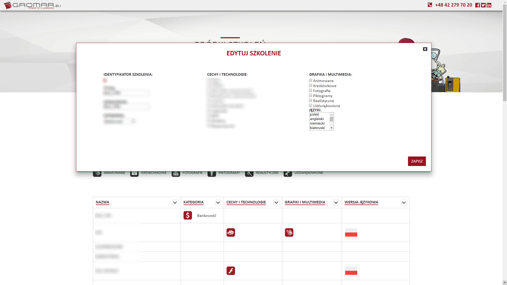

# Próbki szkoleń
> The webpage was made for showing samples of our e-learnings from FTP in nicer way.
Webpage: https://probki.pliki.gromar.eu/_app/

## Table of contents
* [General info](#general-info)
* [Screenshots](#screenshots)
* [Technologies](#technologies)
* [Status](#status)
* [To do](#to-do)
* [Contact](#contact)

## General info
This project is a tool for our account managers. It helps them showing customers samples of our products.
There is possibility to search samples by title and sort samples by title or used technologies.
Content is unavailable without login to service. There isn't way to create new account.
After login user can edit content on the server.

## Screenshots

## Technologies
* VueJS - version 2.5.2
* Vue router - version 3.0.1
* Vue resource - version 1.5.0
* Webpack - version 3.6.0
* Babel - version 6.22.1
* Pug - version 1.0

## Status
Project is in progress: I've done first step of our plan. The webpage works.

## To do:
* Support display on mobile devices
* Create demo version without necessary autorisation

## Contact
Created by Arleta Jędrzejczak - feel free to contact me!
